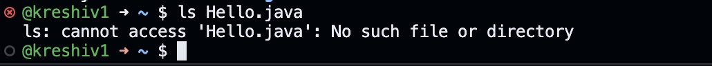
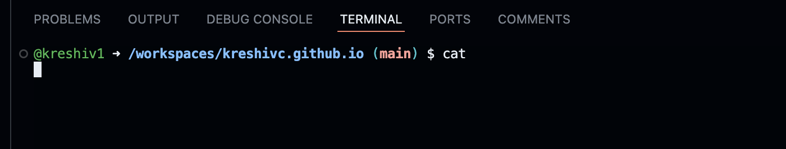
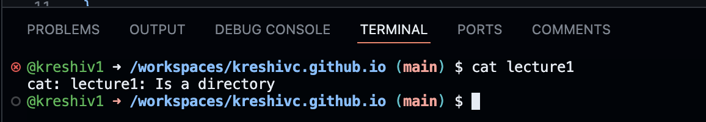
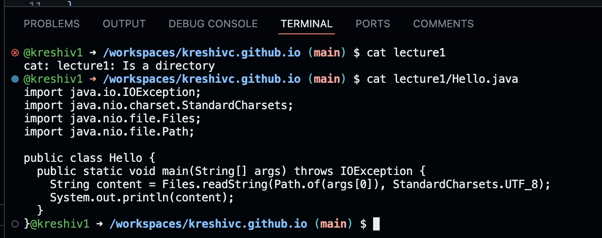

# cs-lab1
lab report 1..

changed directory to home

no error
changed directory to lecture1

error message because `cd` cannot change directory to a file

listed all files in home directory

showed list of files in lecture 1
no error

error because `ls` cannot list file of a file
/workspaces/kreshivc.github.io

no output
no error

error was given as `cat` cannot print items of a directory

lists contents of hello.java
no error
